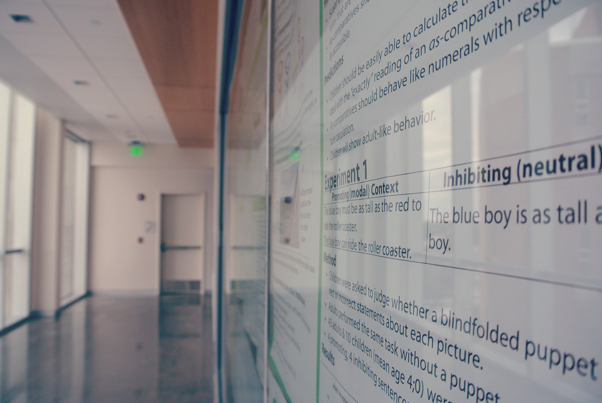

The main focus of our research is how young children learn their first languages. There are three main topics that we are investigating at the moment.

- How do children learn semantic properties of the functional lexicon? Examples: definiteness, plurality, comparatives, implicatures and presuppositions.
- How do properties of the input, particularly its variability and reliability affect the acquisition process?
- How do children acquire and use prosodic properties of language that interact with syntax?

Much of our research is cross-linguistic.  Currently we are studying language acquisition in the following languages:

- Chilean and Mexican Spanish
- Brazilian Portuguese
- Mandarin Chinese
- Japanese
- Korean

