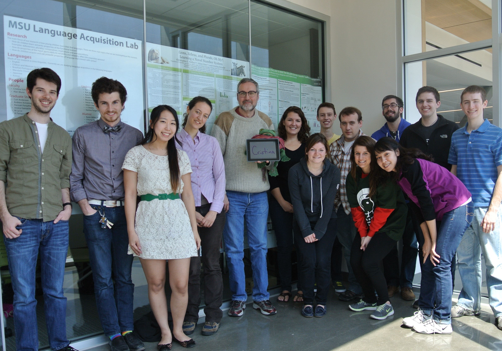

The lab currently consists of the following people. You can also see [past graduate students](https://msuacquisition.wordpress.com/people/graduate-alumni/ "Graduate Alumni") and [past undergraduate students](https://msuacquisition.wordpress.com/people/undergraduate-alumni/ "Undergraduate Alumni").

## Faculty

- Cristina Schmitt
- Alan Munn

## Current Graduate Students

- Komeil Ahari
- Darby Grachek (Research Assistant)
- Daniel Greeson
- Josh Herrin
- Amaresh Joshi
- Ni-La Le
- Sarah Sirna
- Rachel Stacey

## Current Undergraduate Students

- Anthony Delsanter
- Victoria Erdman
- Bobby Felster
- Jett Hampton
- Abby Jaroszewicz
- Sarah Jones
- Becky Lubera
- Erin Marchert
- Hollie Nusbaum
- Megan Placko
- Mercedes Ramon
- Adam Smolinski
- Bruno Takahashi
- Katelyn Weatherford

