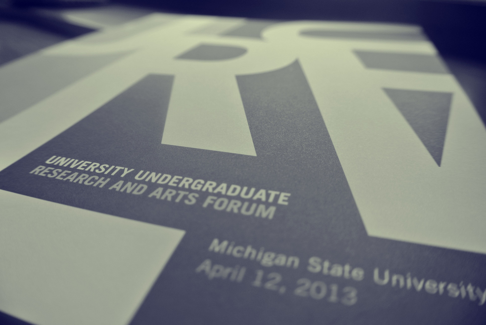

The MSU Language Acquisition Lab has a long tradition of supporting undergraduate research, both in terms of teaching Honors Research Seminars and including undergraduate researchers in all aspects of lab life.  Students from the lab have presented their research at the MSU [University Undergraduate Research and Arts Forum (UURAF)](https://urca.msu.edu/uuraf/ "University Undergraduate Research and Arts Forum (UURAF)") and also at the Boston University Conference on Language Development.

If you are an undergraduate and are interested in the lab, please contact us.

 

