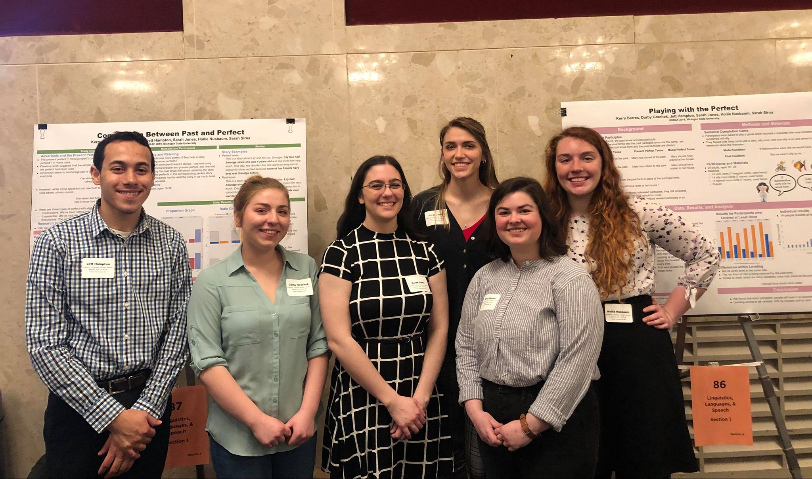
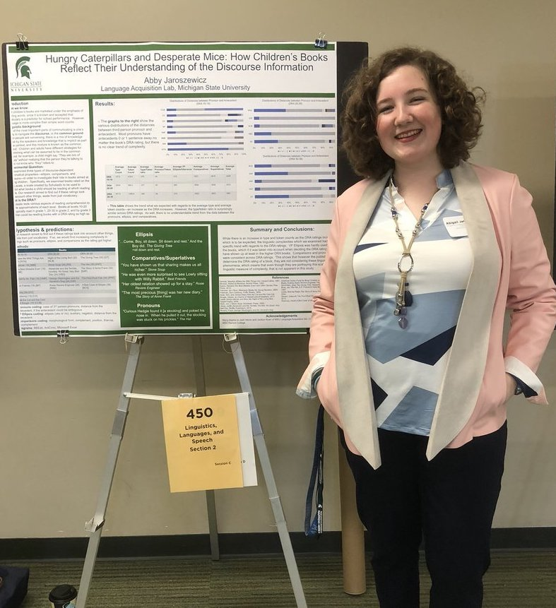

## Welcome to the MSU Language Acquisition Lab

For the latest lab news, check out the [News](http://msuacquisition.wordpress.com/news/ "News") page.

For the projects we are currently working on, check out the [Current Projects](https://msuacquisition.wordpress.com/about/current-projects/) page.

If you are a parent or educator, check out our [Parents](http://msuacquisition.wordpress.com/parents/ "Parents") pages.

If you are a researcher, check out our [Research](http://msuacquisition.wordpress.com/about/ "Research") and [Publications](http://msuacquisition.wordpress.com/publications/ "Publications") pages.

You can also find us on [Facebook](https://www.facebook.com/MSULanguageAcquisitionLab) and [YouTube](https://www.youtube.com/channel/UCBBleHS7UozXfBu5P2MhTIA)!

## Spring 2020 Lab Meetings

Lab meetings for the spring semester are on Fridays, 2:00-3:30 PM in B413 Wells Hall.

## 2018-19 Achievement(s)

### **College of Arts & Letters Award Winners - UURAF 2019 First Place winners**

### _**Competition Between the Past and the Perfect**_ 

Jett Hampton (Linguistics senior); Darby Grachek (Linguistics senior); Sarah Sirna (Linguistics senior); Sarah Jones (Psychology junior); Kerry Berres (Linguistics senior); Hollie Nusbaum (James Madison sophomore)

### English Undergrad **Leads Research in Linguistics - Children's Books**

#### **Abby Jaroszewicz**

“A lot of children’s books are marketed under the guides of number of words, new words, and vocab. That's what determines their reading level,” Jaroszewicz said. “That’s not exactly meaningful linguistically, it’s not the number of words that make a book linguistically complex, there’s lots of different things, like the use of pronouns, which always requires the hearer to work a bit more because they have to find the referent for it in the discourse. The same is true for other aspects of the linguistic system.”

Read the full article here. [http://www.cal.msu.edu/news/english-undergrad-leads-research-linguistics](http://www.cal.msu.edu/news/english-undergrad-leads-research-linguistics)

### Important Dates

- [Boston University Conference on Language Development](http://www.bu.edu/bucld/) (BUCLD40): Abstract deadline May 15, 2015
- [Generative Approaches to Language Acquisition](http://www.gala2015.univ-nantes.fr/96050731/1/fiche___pagelibre/&RH=1416396163857&RF=1416396130982 "GALA") (GALA 2015): Abstract deadline April 1, 2015
- [Generative Approaches to Language Acquisition - North America](https://sites.google.com/site/2015galana/) (GALANA 2015): Held at UMD February 19-21, 2015
