\[caption id="attachment\_319" align="alignnone" width="300"\][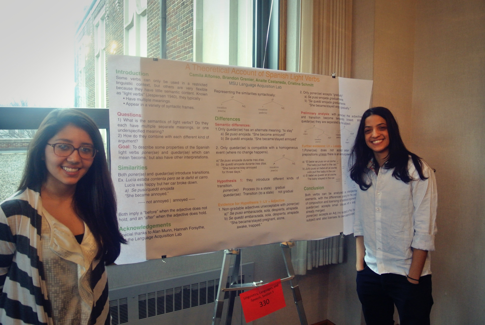](https://msuacquisition.files.wordpress.com/2013/04/uuraf_038.jpg) Camila Alfonso (right), Anaite Castaneda (left), and Brandon Grenier, "Theoretical Account of Spanish Light Verbs"\[/caption\]

\[caption id="attachment\_318" align="alignnone" width="300"\][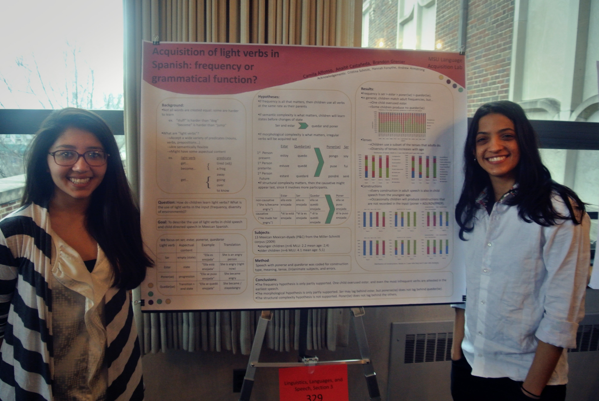](https://msuacquisition.files.wordpress.com/2013/04/uuraf_037.jpg) Camila Alfonso (right), Anaite Castaneda (left), and Brandon Grenier, "Acquisition of Light Verbs in Spanish: Frequency or Grammatical Function?"\[/caption\]

\[caption id="attachment\_317" align="alignnone" width="300"\][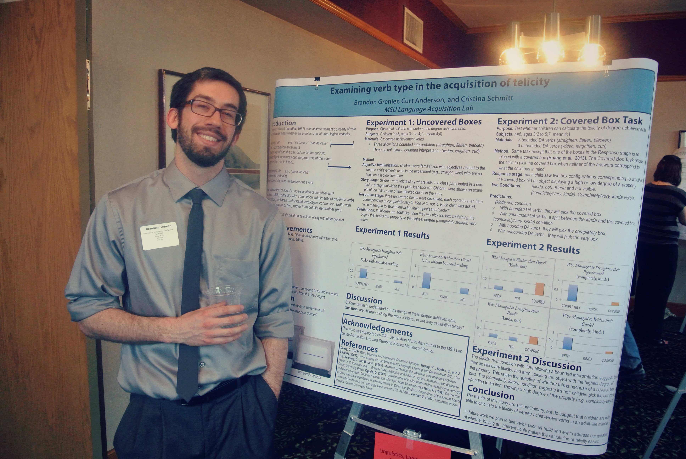](https://msuacquisition.files.wordpress.com/2013/04/uuraf_032.jpg) Brandon Grenier, "Studying the Acquisition of Boundedness in Children: Learning Novel Verbs and Adjectives"\[/caption\]

\[caption id="attachment\_316" align="alignnone" width="300"\][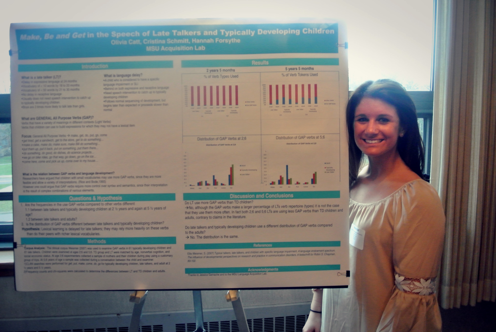](https://msuacquisition.files.wordpress.com/2013/04/uuraf_030.jpg) Olivia Catt, "Make, Be, and Get in the Speech of Late Talkers and Typically Developing Children"\[/caption\]

\[caption id="attachment\_315" align="alignnone" width="300"\][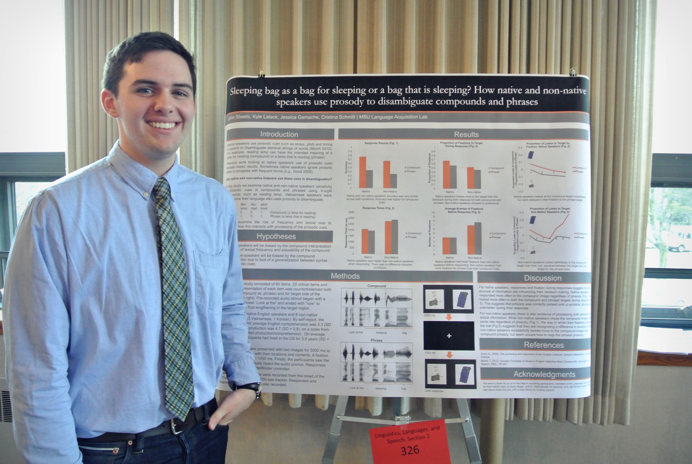](https://msuacquisition.files.wordpress.com/2013/04/uuraf_019.jpg) John Sheets and Kyle Latack, "Sleeping-Bag as a Bag for Sleeping or a Bag that is Sleeping? How Native and Non-Native Speakers Use Prosody to Disambiguate Compounds and Phrases"\[/caption\]

\[caption id="attachment\_314" align="alignnone" width="300"\][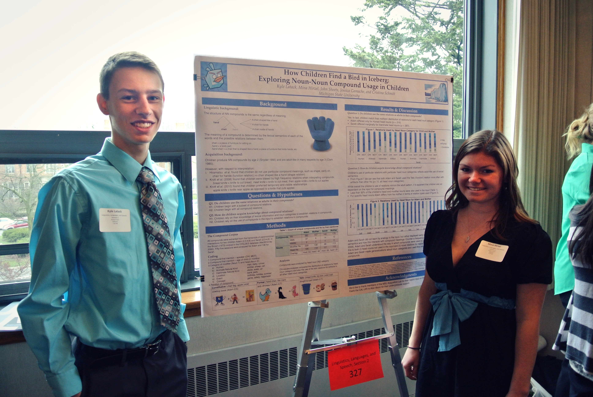](https://msuacquisition.files.wordpress.com/2013/04/uuraf_017.jpg) Kyle Latack (left), Mina Hirzel (right), John Sheets, "How Children Find a Bird in Iceberg: Exploring Noun-Noun Compound Usage in Children"\[/caption\]

\[caption id="attachment\_313" align="alignnone" width="300"\][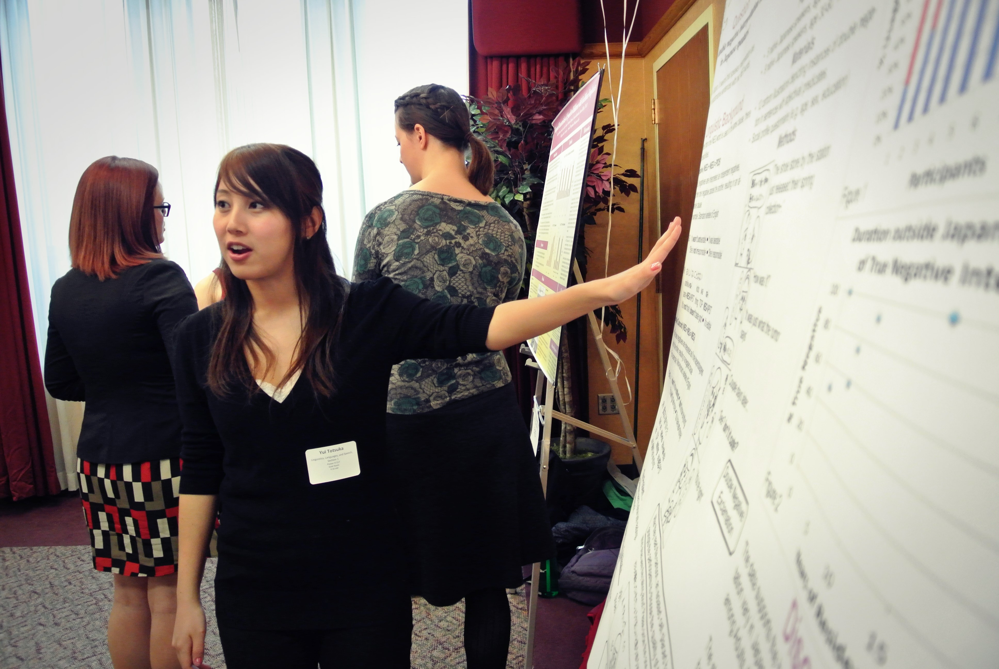](https://msuacquisition.files.wordpress.com/2013/04/uuraf_013.jpg) Yui Totsuka, "The Use of Double Negation by Japanese Teens"\[/caption\]

\[caption id="attachment\_312" align="alignnone" width="300"\][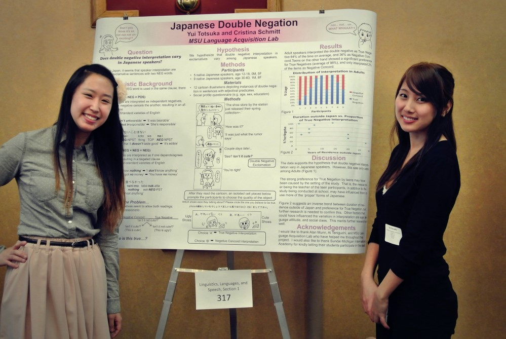](https://msuacquisition.files.wordpress.com/2013/04/uuraf_011b.jpg) Presenter Yui Totsuka (right) with graduate student Ai Taniguchi (left)\[/caption\]

\[caption id="attachment\_322" align="alignnone" width="225"\][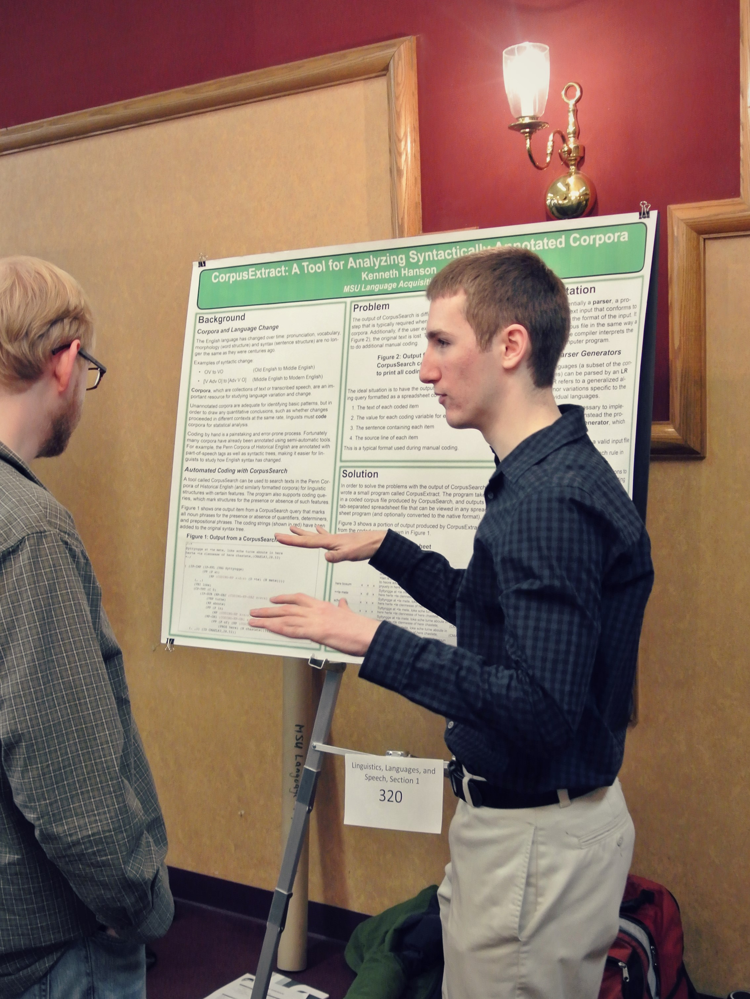](https://msuacquisition.files.wordpress.com/2013/04/uuraf_006b.jpg) Kenneth Hanson, "Corpus Extract: A Tool for Analyzing Coded Syntactically Annotated Linguistic Corpora"\[/caption\]

\[caption id="attachment\_321" align="alignnone" width="300"\][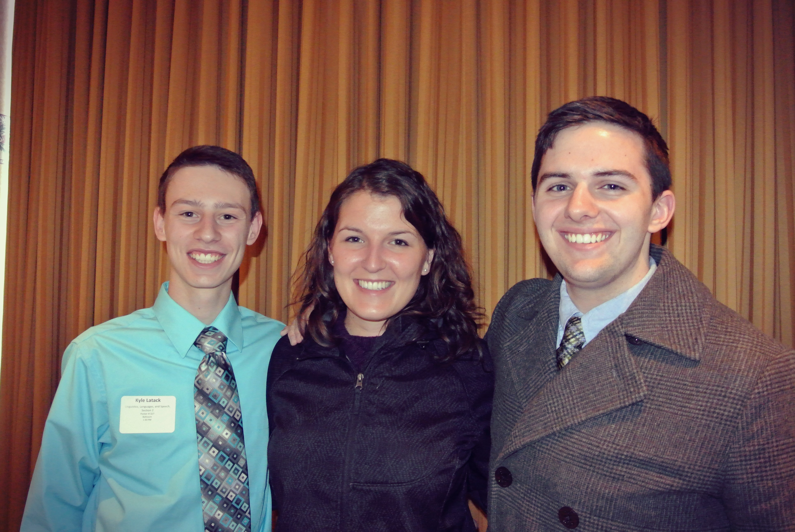](https://msuacquisition.files.wordpress.com/2013/04/uuraf_057.jpg) Winners from Linguistics and Languages Section 2, Kyle Latack (left) and JJ Sheets (right), with graduate student Jessica Gamache (center)\[/caption\]

\[caption id="attachment\_320" align="alignnone" width="300"\][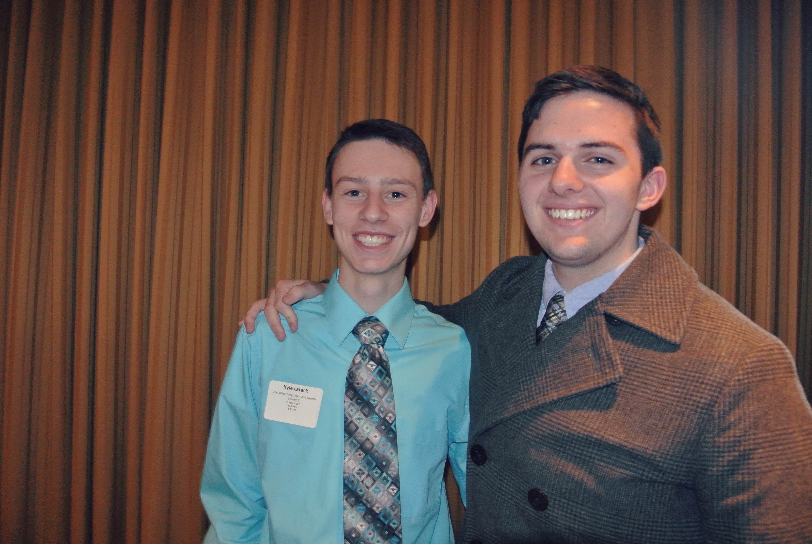](https://msuacquisition.files.wordpress.com/2013/04/uuraf_056.jpg) Winners of Linguistics and Languages Section 2: Kyle Latack (left) and JJ Sheets (right), "Sleeping-Bag as a Bag for Sleeping or a Bag that is Sleeping? How Native and Non-Native Speakers Use Prosody to Disambiguate Compounds and Phrases"\[/caption\]
