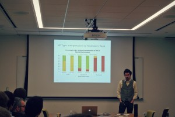

\[caption id="attachment\_344" align="alignnone" width="300"\] Adam Liter, "An Artificial Language Investigation of Number and Number Neutrality"\[/caption\]

 

\[caption id="attachment\_347" align="alignnone" width="200"\] Presenter Adam Liter, also President of qUALMS\[/caption\]

\[caption id="attachment\_348" align="alignnone" width="300"\] All of our GLEEFUL presenters, keynote speaker Chris Kennedy, and qUAMLS members. Many of our undergraduate members are active members of qUALMS!\[/caption\]
