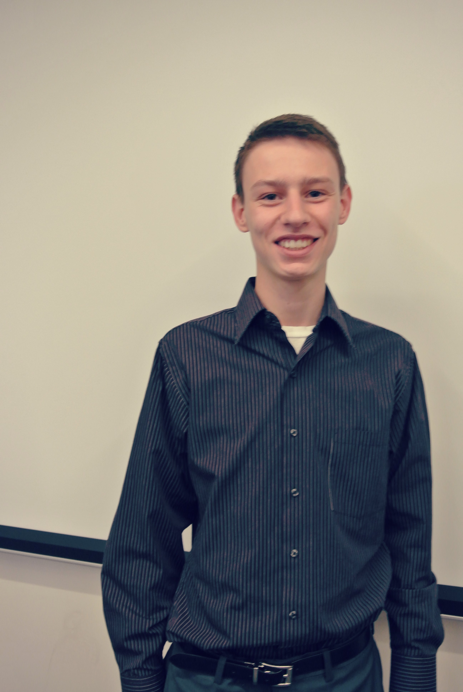
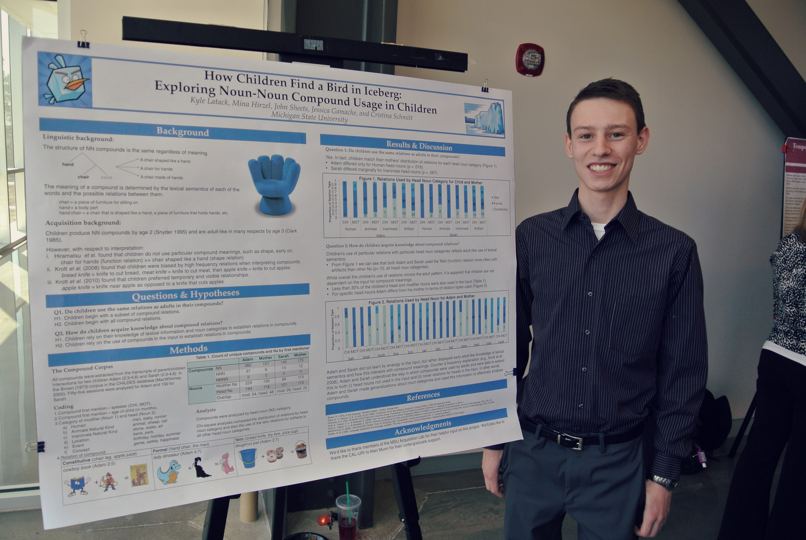
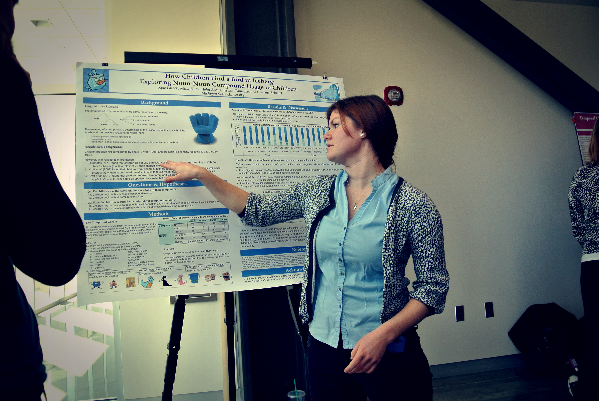
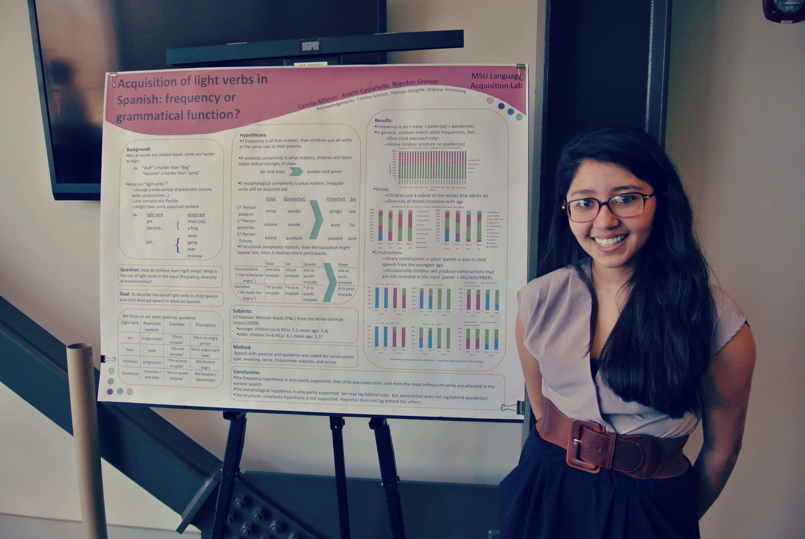
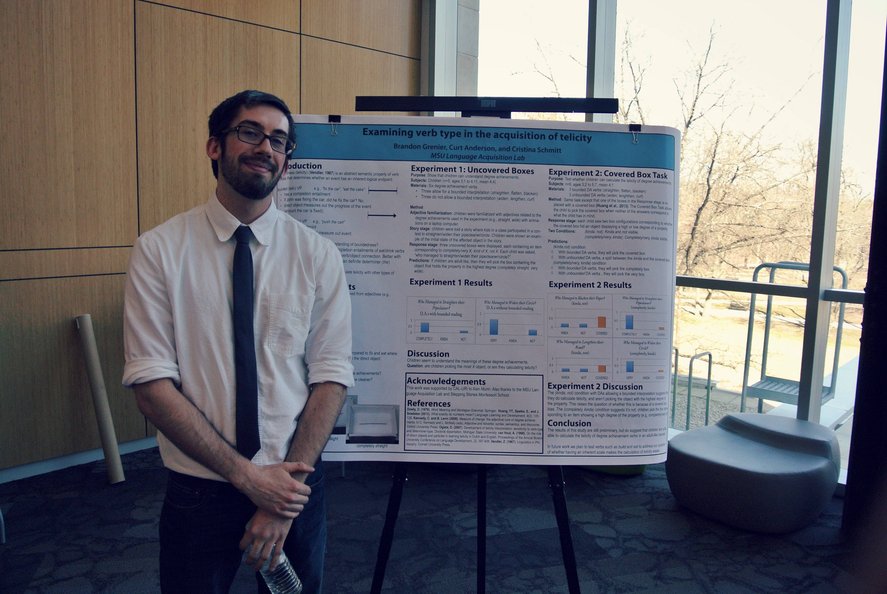
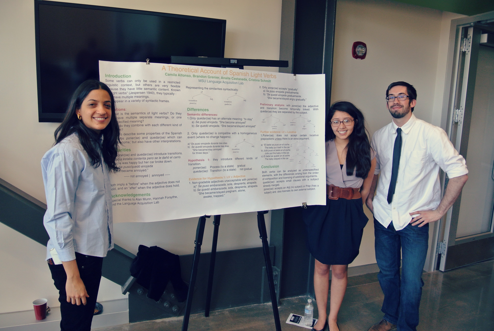
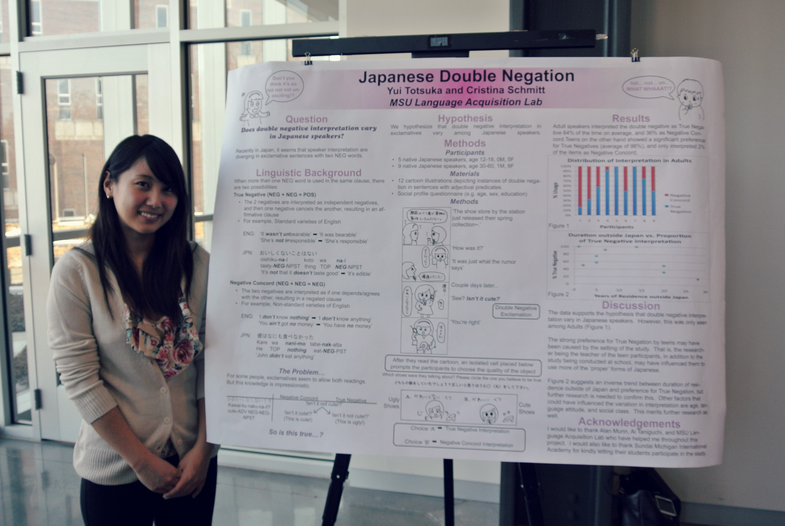
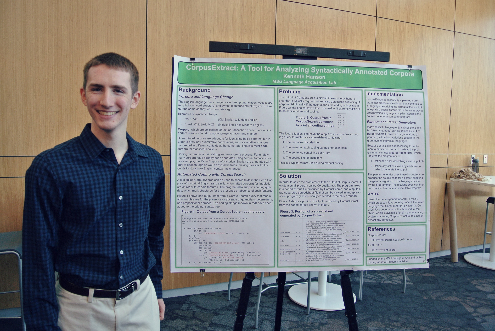
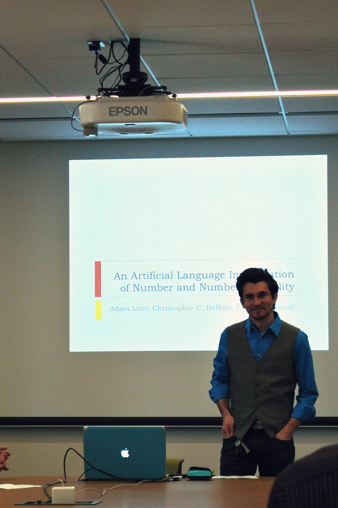

\[caption id="attachment\_335" align="alignnone" width="200"\] Best Poster winner, Kyle Latack (pictured), Mina Hirzel, and John Sheets ("How Children Find a Bird in Iceberg: Exploring Noun-Noun Compound Usage in Children")\[/caption\]

\[caption id="attachment\_334" align="alignnone" width="200"\] Best Poster winner, Yui Totsuka ("Japanese Double Negation")\[/caption\]

\[caption id="attachment\_336" align="alignnone" width="300"\] Kyle Latack　(pictured), Mina Hirzel, and John Sheets, "How Children Find a Bird in Iceberg: Exploring Noun-Noun Compound Usage in Children"\[/caption\]

\[caption id="attachment\_328" align="alignnone" width="300"\] Kyle Latack, Mina Hirzel (pictured), and John Sheets, "How Children Find a Bird in Iceberg: Exploring Noun-Noun Compound Usage in Children"\[/caption\]

\[caption id="attachment\_333" align="alignnone" width="300"\] Camila Alfonso, Anaité Castaneda (pictured), Brandon Grenier "Acquisition of Light Verbs in Spanish: Frequency or Grammatical Function?"\[/caption\]

\[caption id="attachment\_332" align="alignnone" width="300"\] Brandon Grenier "Examining Verb Type in the Acquisition of Telicity"\[/caption\]

\[caption id="attachment\_330" align="alignnone" width="300"\] Camila Alfonso, Anaité Castaneda, Brandon Grenier "A Theoretical Account of Spanish Light Verbs"\[/caption\]

\[caption id="attachment\_331" align="alignnone" width="300"\] Yui Totsuka, "Japanese Double Negation"\[/caption\]

\[caption id="attachment\_329" align="alignnone" width="300"\] Kenneth Hanson, "Corpus Extract: A Tool for Analyzing Coded Syntactically Annotated Linguistic Corpora"

Adam Liter, "An Artificial Language Investigation of Number and Number Neutrality"\[/caption\]
